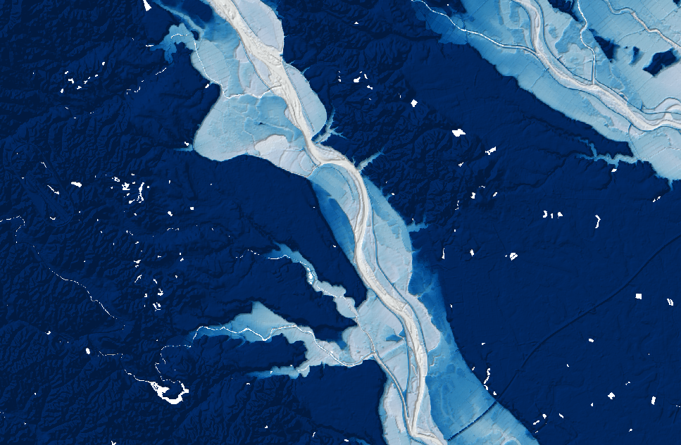

# Relative elevation model

## Tools

- QGIS

## Data sources

- DEM: [国土地理院基盤地図情報](https://fgd.gsi.go.jp/download/menu.php)
- Centerline of streems: [国土数値情報](https://nlftp.mlit.go.jp/ksj/)

## How to make

1. Get a DEM and a line data of a stream centerline
2. Construct pointa along the stream line with a proper dense
3. Extract DEM values to the points
4. Run IDW tool and create an interpolated raster from points
5. Calculate Original DEM minus interpolated raster

## Visualisation tricks

1. As a base layer, lay hillshade
2. Select multiply mode For the REM layer
3. Strech the color gradation range relatively small like -2 to 20m to highlight the floodplain

## References

- [Floodplain visualization using lidar-derived relative elevation models](https://www.dnr.wa.gov/publications/ger_presentations_dmt_2016_coe.pdf)