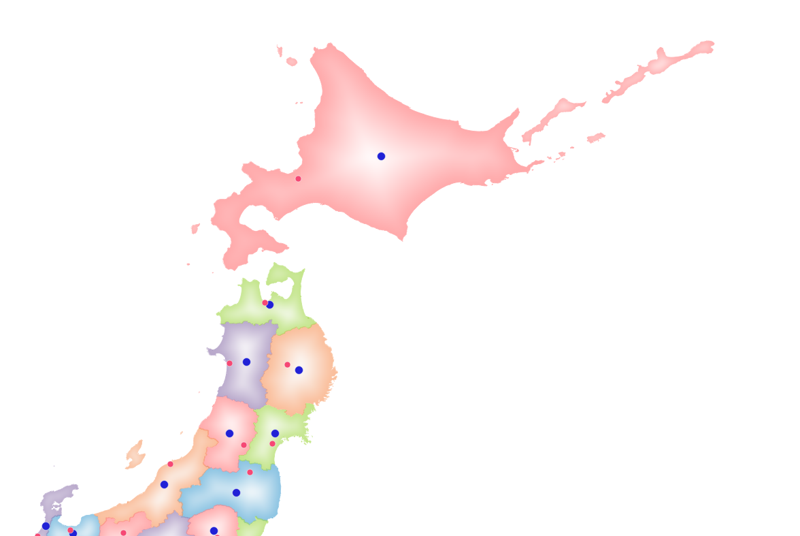
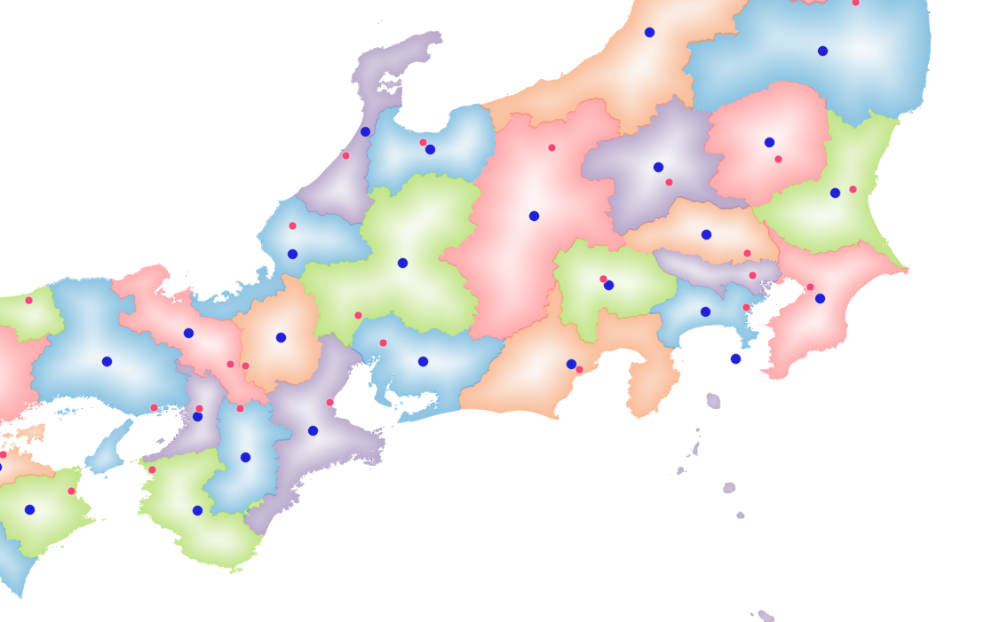
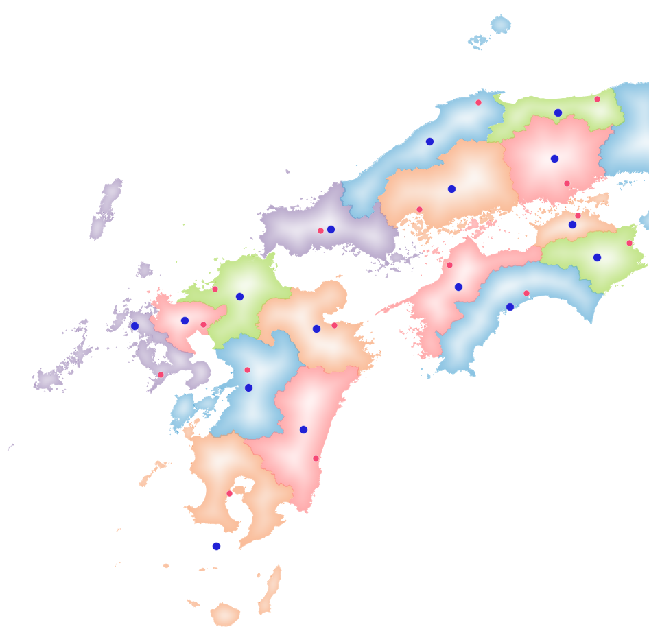
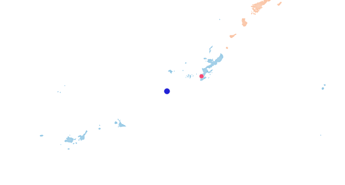

# Tools
- QGIS

# Data source
国土数値情報ダウンロードサービスより以下のデータを利用しました。
- [行政区域データ](https://nlftp.mlit.go.jp/ksj/gml/datalist/KsjTmplt-N03-v2_3.html)
- [国・都道府県の機関](https://nlftp.mlit.go.jp/ksj/gml/datalist/KsjTmplt-P28.html)

 
 
 
 
